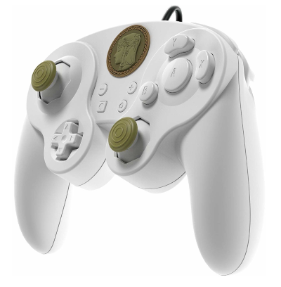
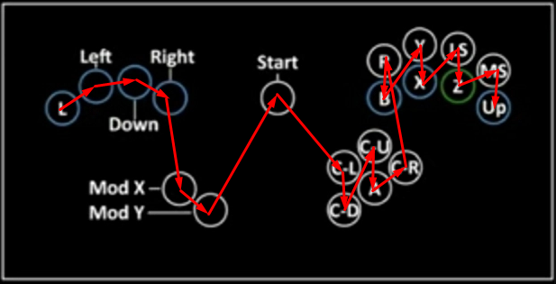
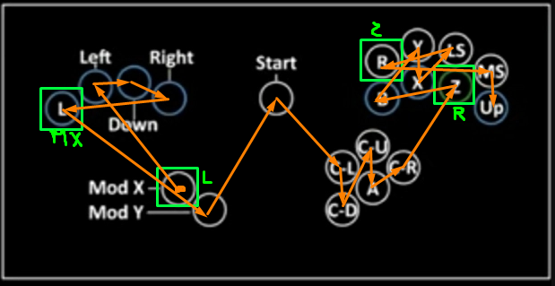
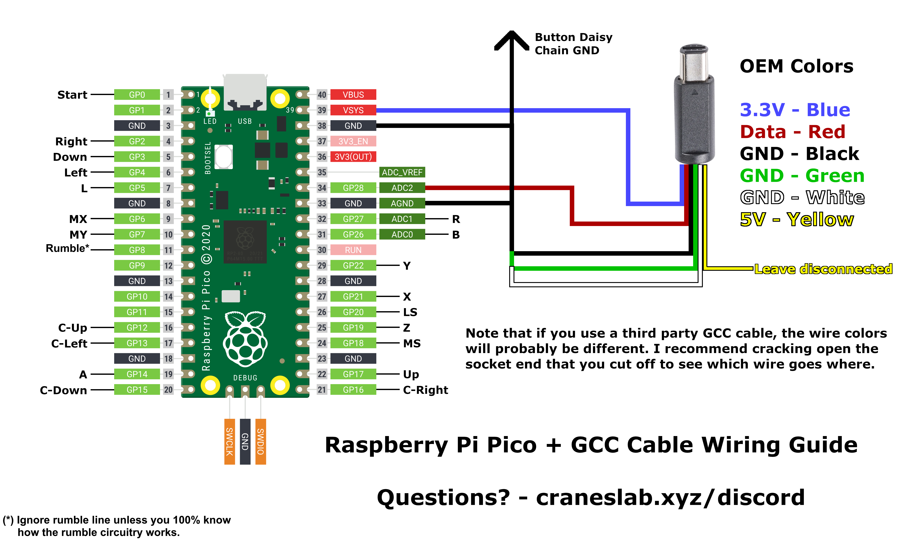
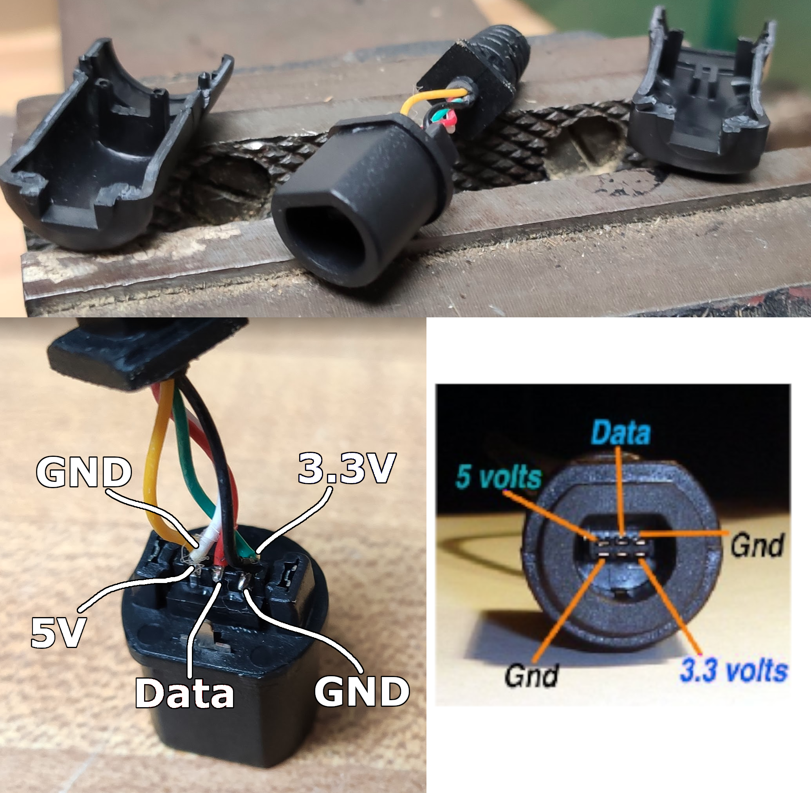
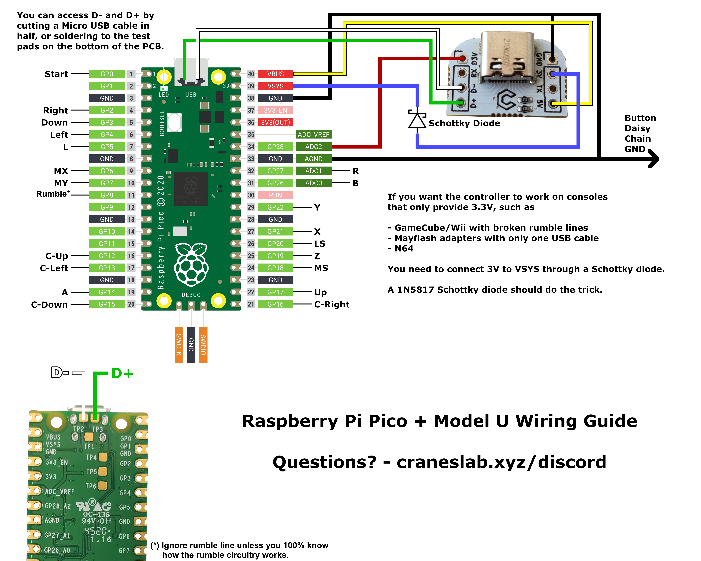

# Frame1/B0XX layout style public-source digital controller software for the Raspberry Pi Pico (v1.0)

- [Legal information and license](#legalInformationAndLicense)
- [Firmware explanation](#firmwareexplanation)  
- [Safety information](#safetyInformation)  
- [Raspberry Pico Perks](#raspberryPicoPerks)
- [How to program your board](#howToProgramYourBoard)
- [Modes](#modes)
- [Advised modes](#advisedModes)
- [Melee mode notes](#meleeModeNotes)
- [Wired Fight Pad Pro mode logic](#wfppModeNotes)
- [8KRO Keyboard mappings](#keyboardMappings)
- [Adapter mode information](#adapterModeInformation)
- [Runtime remapping information](#runtimeRemappingInformation)
- [How to wire the board](#howToWireTheBoard)
- [Troubleshooting](#troubleshooting)
- [Contact](#contact)

This is a modular, runtime-remappable and easily extensible digital controller software for the Raspberry Pi Pico, that can identify as various controllers and communicate over the Joybus (Gamecube/Wii) and USB protocols and using various conversion logics, namely at least Melee, P+, Ultimate, generic controller and generic keyboard.

<a name="legalInformationAndLicense"/>

This project is free to use for personal use; i.e for use with controllers you build and use yourself, usually referred to as "DIY controllers".

You may not sell devices with this firmware uploaded or suggest to people to use this firmware with a device you sell, past the first 50 devices sold.
You may not upload this firmware onto a device you've bought that didn't come with a license for it.

You may not use parts of this firmware in another firmware used for anything but personal use, and may not redistribute parts of this firmware under a license that waives this requirement.
Should you want to use this firmware or parts of this firmware commercially, contact me.

### LEGAL INFORMATION

THE SOFTWARE IS PROVIDED "AS IS", WITHOUT WARRANTY OF ANY KIND, EXPRESS OR IMPLIED, INCLUDING BUT NOT LIMITED TO THE WARRANTIES OF MERCHANTABILITY, FITNESS FOR A PARTICULAR PURPOSE AND NONINFRINGEMENT. IN NO EVENT SHALL THE AUTHORS OR COPYRIGHT HOLDERS BE LIABLE FOR ANY CLAIM, DAMAGES OR OTHER LIABILITY, WHETHER IN AN ACTION OF CONTRACT, TORT OR OTHERWISE, ARISING FROM, OUT OF OR IN CONNECTION WITH THE SOFTWARE OR THE USE OR OTHER DEALINGS IN THE SOFTWARE.

In particular, when communicating over USB, device using this software may use the 0x057E USB Vendor ID, that is affiliated with Nintendo, and other proprietary USB vendor IDs. By uploading this software onto your board, you assert that you understand what that means and take entire responsability for it.

<a name="firmwareexplanation"/>

### Firmware explanation

The job of a digital controller firmware can be split in three questions:
- Convert electrical inputs into knowing which buttons on the digital controller is pressed. Example: "pin 20 is low" => "X is pressed".
- Convert (which buttons of the digital controller are pressed) to an emulated controller state. For exemple, when emulating a Gamecube controller and using the Melee Frame1 logic, you would press MX+Down+Right and expect the controller to send an angle suitable for long wavedashes to the right.
- Communicate over a given protocol with the PC or console your controller is plugged to. This implies asking the question of "what controller are you pretending to be ?".

The modes of the firmware are modular based on this separation. A mode is the combination of 3 choices:
- The "GPIO to button set" i.e how you name your pins. There's only one choice by default. It can be remapped at runtime in a way that will persist when shut down.
- The "DAC conversion algorithm" or put shortly, "logic". There are Melee F1, P+ and Ultimate logics, plus specific ones for specific usb configurations.
- The "communication protocol (+ usb configuration)". The controller can become a Gamecube controller, or it can become a USB device, in which case you have the choice between a Gamecube controller to USB adapter that has a Gamecube controller (your controller) plugged in P1 (the default), a generic HID controller, a keyboard, or a Switch-compatible controller (aka WFPP).

You will access a given mode by holding a given button down while you plug-in the controller.

A + B will refer from now on as a combination of a DAC conversion algorithm and a communication protocol(+usb config is protocol is USB).

The code architecture follows the outline previously explained. The code is separated in `gpio_to_button_sets`, `dac_algorithms`, `usb_configurations`, `communication_protocols`.

If you want to modify or extend the firmware, you shouldn't need to modify `usb_configurations` unless you want to, say, add a button to the HID controller you're emulating. And you shouldn't ever need to modify `communication_protocols`. Modify `dac_algorithms` to change things such as coordinates, modify `gpio_to_button_sets` only if your firmware is so unlike the Frame1 default that your buttons have different names. (Ex more than 2 modifiers...)

This project doesn't utilize TinyUSB, but instead implements the USB protocol itself to manage runtime-dependant descriptors. This is largely based on the dev_lowlevel pico-example project, although fully migrated to C++, with some extensions such as WCID compatibility and multi-packet control transfers.

<a name="safetyInformation"/>

### Safety information

Don't have this board plugged via USB and via its Gamecube port at the same time. This would feed the USB 5v to the 3v line of the console and likely damage it.

If you want to prevent this electrically, use Schottky diodes, or power VSYS with the 5v from the console and don't connect the console 3v. Be aware that doing this implies the controller won't work on consoles with broken rumble lines anymore.

<a name="raspberryPicoPerks"/>

### Raspberry Pico Perks

- Up to 25 inputs + a console data line

- No 5V input required (Voltage regulator accepts 3.3V)

- No logic level shifter required (3.3V GPIO by default)

- Extremely simple programming (USB drag and drop)

- Much higher (~8x) MCU speed allows reacting to console poll rather than having to predict them, hence better latency (i.e matches Frame1 latency give or take a few cycles which is slightly better than that of B0XX/other atmega32u4 based controllers)

- 1000Hz effective reporting over USB, which some atmega32u4 based controllers (notably the B0XX) don't have, granting better latency & latency stability

- Identifying as a GCC to USB adapter where your controller is plugged in port 1 means that this is compatible with WinUSB-only features (Kristal's netcode, timing dispersion reduction)

- Very cheap ($4~5) and widely available

<a name="howToProgramYourBoard"/>

### How to program your board:

- Download the latest release (on the right of the Github page)

- Plug in your Raspberry Pico to your computer by holding pin GP16 (the CRight button in the advised pinout) via USB (i.e BOOTSEL mode), or while holding the "BOOTSEL" white button on the board.

- The board should appear as an external drive. Put the .uf2 in there. The board should disconnect and be ready for use.

If you reconnect the board in BOOTSEL mode, you won't see the .uf2 file anymore. This is normal, expected behavior.

<a name="modes"/>

### Modes

As of this release, 13 modes are built-in.

- GP16 (by default, CRight) => BOOTSEL mode. This allows for updating the firmware without taking apart the controller to access the Pico.

- GP17 (by default, Up) => Runtime remapping. See dedicated paragraph.

- Not plugged into USB => Console mode (Melee F1 DAC algorithm + Joybus), unless you press GP2 or GP7 (by default Right and MY), in which case you enter P+ mode, or GP6 (by default MX), in which case you enter Ultimate mode. If you're not plugged into USB, you enter this mode.

- GP21 / GP22 / GP10 (by default, X/Y/LS) resp. => HID controller with Melee / Ult / P+ logic resp.

- GP7 / GP6 (by default, MY/MX) => P+ / Ult resp. GCC to USB adapter mode (P+/Ult DAC algorithm + Adapter USB configuration).

- GP2 / GP5 (by default, Right/L) resp. => Wired Fight Pad Pro with P+/Melee resp. logic (P+/Melee DAC algorithm + Wired Fight Pad Pro USB configuration).

- GP4 (by default, Left) => Wired Fight Pad Pro with dedicated logic (Wired Fight Pad Pro DAC algorithm + Wired Fight Pad Pro USB configuration). See lower for DAC algorithm explanation.

- GP0 (by default, Start) => 8KRO Keyboard (8 Keys set DAC algorithm + 8KRO Keyboard USB configuration). See lower for mapping.

- Plugged into USB, nothing pressed => Melee GCC to USB adapter mode (Melee F1 DAC algorithm + Adapter USB configuration).

<a name="advisedModes"/>

**The advised modes are the following**:
- Playing Melee resp. P+ on console => Melee resp. P+ + Joybus
- Playing Melee resp. P+ on PC => Melee resp. P+ + Adapter mode
- Playing Ult on Switch or PC => Ultimate + Adapter mode
- Playing other PC games => Melee + HID or 8KeysSet + Keyboard
- Playing other games on Switch => WFPP + WFPP
- Playing Melee/P+ on PC on the same setup as someone using a Gamecube controller and therefore an adapter => Melee/P+ + HID & configure the HID

Configuring the HID means: selecting the Frame1 profile in top right corner of the configuration window (Controllers > Standard Controller > Configure), changing the selecfed device to "pico-rectangle - HID with triggers" and reconfiguring the Control stick Up/Down & C-Stick Up/Down inputs.

Note that by "Adapter mode", I mean making the controller claim to be an adapter. You should never need to use a separate Gamecube to USB adapter. Also, none of the modes require driver installation; in particular the adapter mode will install WinUSB on plug-in. The adapter and WFPP modes are compatible with the Switch.

<a name="meleeModeNotes"/>

### Melee mode notes

The logic is that of the Frame1, with the slight side B and parasol dashing nerfs removed. They can be added back in the code via a toggle.

<a name="wfppModeNotes"/>

### Wired Fight Pad Pro mode logic

This is a "Wired Fight Pad Pro":

With the Melee F1 DAC algorithm, Start is mapped to +. L, R and Z are respectively mapped to ZL, ZR and R. -, Home, L and Photo are inaccessible. The purpose of this mode is to allow playing on a PC setup with other people that are using vanilla Gamecube controllers through an adapter, as Slippi can't handle multiple adapters at once. There may be slight analog discrepancies occuring as a result of using the Standard Controller mode (max 1 tick).

In dedicated mode, Modifiers and LS/MS are repurposed. This means you can only access cardinals and diagonals on the control stick.
- LS => L
- Z => R
- L => ZL
- R => ZR
- MX => -
- MY => +
- Start => Home
- MS and Left => Dpad left
- MS and Right => Dpad right
- MS and Up => Dpad up
- MS and Down => Dpad down
- MS and Start => Photo

<a name="keyboardMappings"/>

### 8KRO Keyboard mappings

Button mappings:

- L => q
- Left => w
- Down => e
- Right => r
- MX => a
- MY => s
- Start => t
- R => y
- B => h
- Y => u
- X => j
- LS => i
- Z => k
- MS => o
- Up => l
- C-Up => g
- C-Left => f
- C-Right => b
- C-Down => c
- A => v

<a name="adapterModeInformation"/>

### Adapter mode information

In adapter mode, upon connecting the Raspberry Pi Pico to your PC after uploading the software at hand onto it, the Raspberry Pi Pico will identify as a "WUP-028" i.e a Gamecube controller to USB adapter. Things will behave as if the Gamecube controller this board emulates was plugged in port 1. You need to use the "GameCube Adapter for Wii U" in the Slippi Controllers tab (which is the default). You don't need to configure anything.

However, in order to use this controller, you must first unplug any Gamecube controller to USB adapter connected to your PC, as softwares will typically only support communicating with one adapter at a time (notably Dolphin/Slippi).

Note that this mode of operation requires the "WinUSB" driver to be associated with this device. If you've used a Gamecube controller to USB adapter before, chances are you've associated WinUSB to the WUP-028 through Zadig. But even if you haven't, you shouldn't need to, as WinUSB will be installed automatically upon plugging the Pico board in.

Note that polling rate enforcements using the HIDUSBF filter driver that apply to "standard" WUP-028s will apply to this board, so enforced rates less than 1000Hz you could have configured would decrease this controller's performance, which is 1000Hz by default.

Automated WinUSB installation is very experimental. If you encounter any driver related issue, please contact me.

<a name="runtimeRemappingInformation"/>

### Runtime remapping information

This project allows you to modify the default pin -> button mappings (i.e that of GpioToButtonSets::F1) in a persistent manner at runtime, i.e you don't need to download any development tools, modify the code and reprogram the board, follow these instructions once and your mappings will be changed forever and will persist even when you update the firmware.

When plugging the board, press whichever button is mapped to GP17 (in the default pinout, it's Up). 3 seconds later, you'll enter remapping mode. Press the buttons in the following order: L Left Down Right MX MY Start CLeft CDown CUp A CRight R B Y X LS Z MS Up.

Note that you must release GP17 before the 3 seconds expire, or it will be considered as the first button press (L).

So, if for example you haven't followed the default pinout when soldering and would like to go back to the default B0XX/F1, you'll press the buttons in this order:

Say you'd like to swap L/MX, and R/Z, you'd press the buttons in this order:

When plugging the board in, wait for 3+ seconds before starting to press any buttons.

The remapping will be committed when you've pressed 20 different buttons. You must restart (i.e unplug/replug) to enter another mode. The pins you can map something to are GP 0-22 and GP 26-27, i.e all accessible pins EXCEPT GP28, that is dedicated to the GC Data pin.

If it doesn't appear to work, double check all 20 of your buttons work. Note that runtime remapping doesn't change what buttons you need to press to enter a given mode, as it is the pin number that matters.

<a name="howToWireTheBoard"/>

### How to wire the board:

Note: big thanks to Crane for the schematics !

#### If you just have a GameCube cable :

#### If you are using a third party cable :

#### If you are using a generic USB-C breakout :

#### If you are using a Model U breakout :

Switches/buttons will have two pins. Connect one of them to Ground (daisy chaining advised) and the other to a Pico GPIO pin following the mapping shown in the images above.

Note that all "button" pin mappings can be modified later on using the runtime remapping feature, but the GameCube Data line can't and must be connected to GP28.

<a name="troubleshooting"/>

### Troubleshooting

Console mode/B/R don't work -> Did you connect pin 33 to ground ?

Nothing but B/R works -> Did you connect pin 38 to ground ?

Only half/some of my buttons do anything -> Double-check your common ground between all of your buttons.

<a name="contact"/>

### Contact

Discord: Arte#9281

Twitter: https://twitter.com/SSBM_Arte
